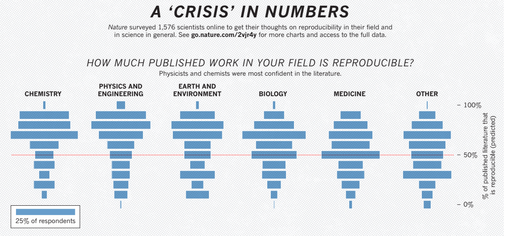
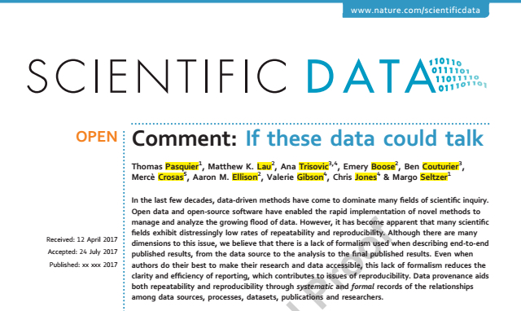

# Pitcher Microecosystems

\ 

# Multilayer network analysis

\ 


<!-- Pic pitcher plants -->
<!-- Pic Holly Molly sampling description -->

<!-- - Data set comprised of observations of individuals synthesized into -->
<!--   hundreds of network models -->
<!-- - Data collected by two researchers in two locations 20 years ago -->
<!-- - Models developed by two researchers and tailored to current data -->

# Multilayer networks

\  \ 


# Multilayer networks

\ 


# A Reproducibility Crisis (Baker 2015)

\ 

# A Reproducibility Crisis (Baker 2015)

\ 

# Open Process (Pasquier et al. 2017)

\ 

# Open Process (Pasquier et al. 2017)

\ 

# Challenge: How do you know what the code acutally does?

```
q <- runif(1)
if (q > 0.5){
     print("Yay!")
   }else{
     print("boooo!")
}
```


# Data Provenance and Ecological Networks

\ 

<!-- - Network metrics and provenance [@Lau2017] -->
<!-- - Diffuse data collection -->
<!-- - Model benefaction -->


# ProvTools

\ 

# ProvTools

\ 
\ 

# ProvTools

\ 
\ 

# provR (aka. RDataTracker)

\ 

# cleanR
\ \ 


# encapsulator

\ 


# enaR model packing (Borrett and Lau 2014)

\ 

# Policy: *OPEN* Science  = data + source + process

\ 


# Policy: *OPEN* Science = data + source + process

\ 

# Thank you

Interested in alpha testing or more information about provenance and ProvTools:

**provtools.org**


**Email me: _matthewklau@fas.harvard.edu_**
